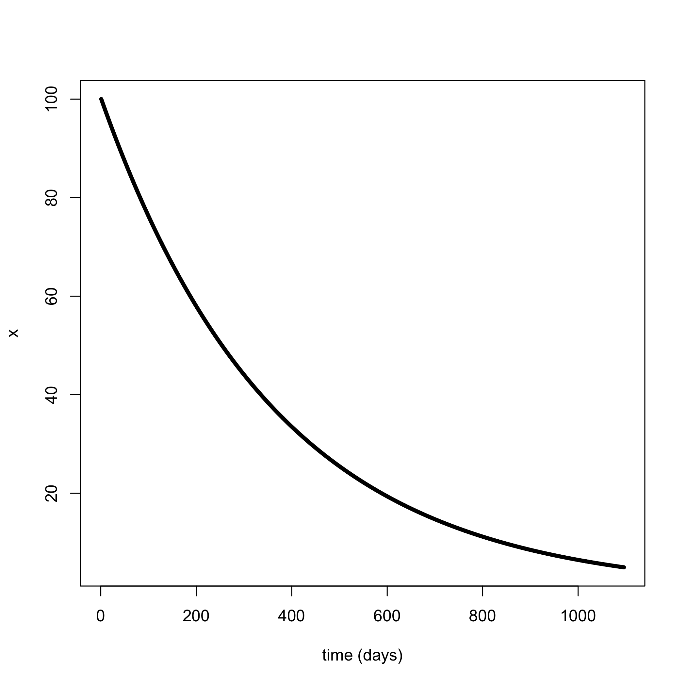
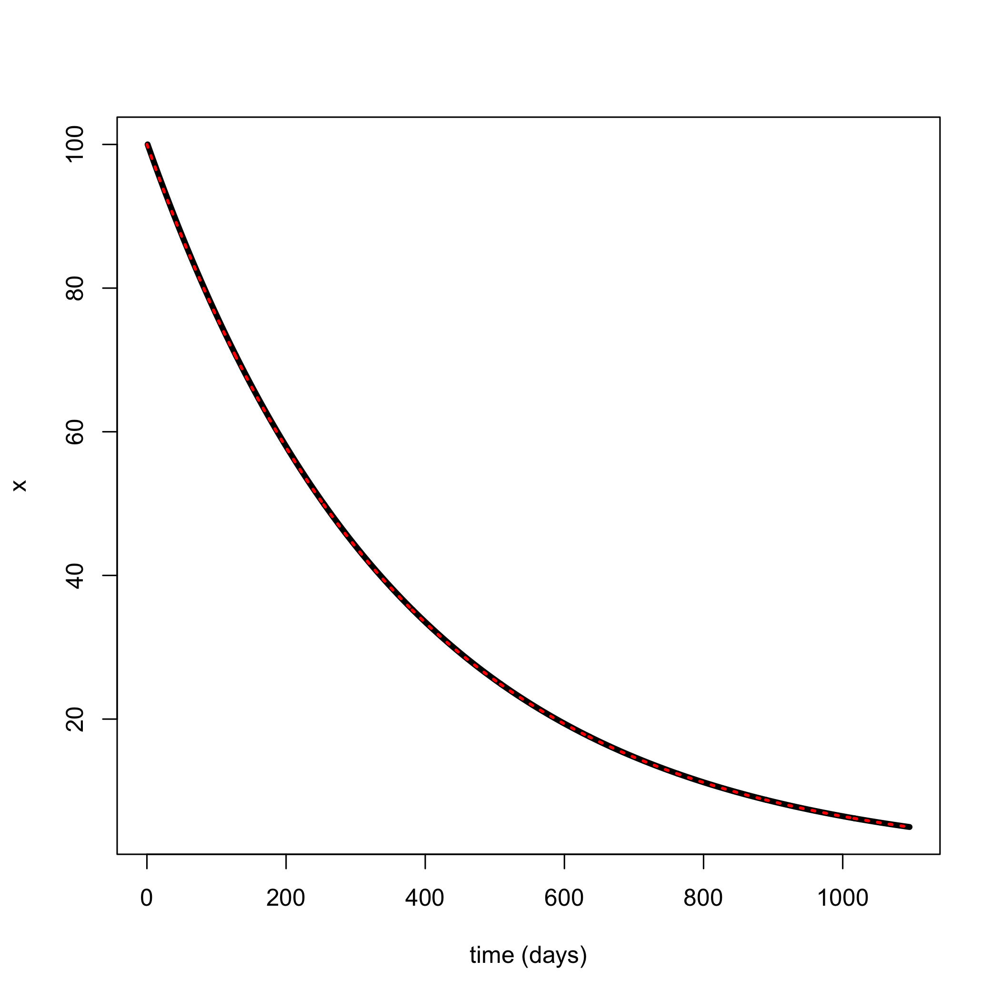
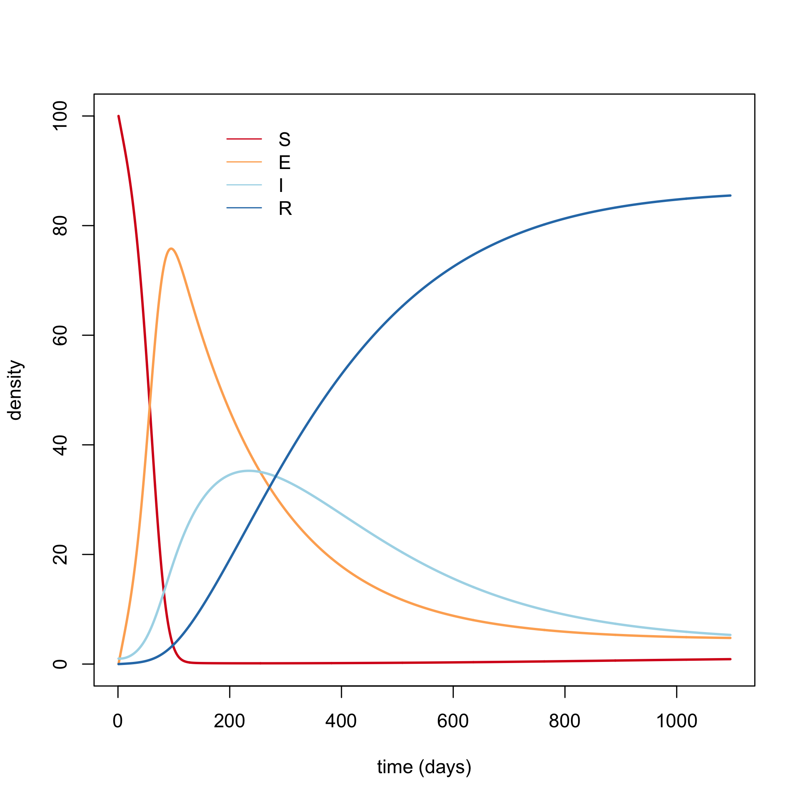

<script src="js/hideOutput.js"></script>

<style type="text/css">
#TOC {
  color: black;
}
</style>


<style>
p.caption {
  font-size: 0.6em;
}
</style>

<style type="text/css">
.showopt {
  background-color: #004c93;
  color: #FFFFFF; 
  width: 100px;
  height: 20px;
  text-align: center;
  vertical-align: middle !important;
  float: right;
  font-family: sans-serif;
  border-radius: 8px;
}

.showopt:hover {
    background-color: #dfe4f2;
    color: #004c93;
}

pre.plot {
  background-color: white !important;
}
</style>


# Introduction

We will look at some very simple systems of ordinary differential equations (ode).  From the very simplest, we'll look at the exponential decay model just to illustrate how to conduct numerical integration in R using  `deSolve`.  Then, we'll look at an SEIR (susceptible, exposed, infected, recovered) model.  

# The models
## Exponential decay
If we assum that $z$ represents the instantaneous natural mortality (sometimes called the hazard) of an organism in a population whose density at time $t$ is denoted $x(t)$, then we can write an ode for the rate of change of the density as:

\begin{equation}
\frac{dx}{dt} = - z x(t)
\end{equation}

This happens to have an analytical solution for $x(t)$ given a starting value $x(t= 0)$ or just $x(0)$ (using separation of variables and integration).  

\begin{equation}
x(t) = x(0) e^{- z t}
\end{equation}

This model can be used to characterize anything that decays at some constant per capita rate.  That doesn't just have to represent death, but can be movement from one compartment into some other compartment as well.  

## SEIR models

An SEIR model uses four compartments to model disease.  The fifth compartment (dead things) is not modeled explicitly here, but could be.

Consider the rate of change of of susceptible individuals ($S(t)$) at any given time ($t$) as the loss of individuals due to the per capita rates of (1) natural mortalty ($z$), (2) fishing mortality ($f$), and (3) exposure ($\beta$) to some disease. Exposure per individual scales with the number of infected individuals at a given time ($I(t)$)  At the same time, individuals are added at some constant recruitment rate $r$.  

\begin{equation}
\frac{dS}{dt} = - \left[z + f + b I(t)\right] S(t) + r
\end{equation}

Individuals that are exposed, but not yet infected, first get added to the exposed group ($E(t)$ based on the rate of exposure, and then are removed by the combination of natural mortality, fishing, and movement into the full on infected category ($I(t)$) at per capita rate $k$. 

\begin{equation}
\frac{dE}{dt} = b I(t) S(t) - \left[z + f + k \right] E(t)
\end{equation}

The individuals in the infected category die at a rate that is the sum of the natural mortality, fishing mortality, and the additional risk of mortality due to infection ($\delta$) in addition to the rate of recovery ($\gamma$) into the recovered category.

\begin{equation}
\frac{dI}{dt} = k E(t) - \left[z + f + \delta + \gamma \right] I(t)
\end{equation}

Finally, recovered individuals are gained by recovery and die by natural mortality and fishing mortality. 

\begin{equation}
\frac{dR}{dt} = \gamma I(t) - \left[z + f \right] R(t)
\end{equation}

# Coding the models in R

Well now code the models in R.

## Load packages and functions

First lets load the required packages and functions


```r
# load required packages
library(RColorBrewer)
library(deSolve)

# load required functions 
source("../R/example_odes.R")
```

Inspect the two systems of odes as functions:

```r
exp_decay_ode
```

```
## function (t, state, parameters) 
## {
##     with(as.list(c(state, parameters)), {
##         dx <- -z * x
##         list(c(dx))
##     })
## }
```

```r
seir_ode
```

```
## function (t, state, parameters) 
## {
##     with(as.list(c(state, parameters)), {
##         dS <- -(z + f + beta * I) * S + r
##         dE <- -(z + f + k) * E + beta * I * S
##         dI <- k * E - (z + f + delta + gamma) * I
##         dR <- gamma * I - (z + f) * R
##         list(c(dS, dE, dI, dR))
##     })
## }
```

Note that `deSolve` requires the system of odes to be a function takes arguments for time, the state variables, and parameters that control dynamics of the system. 

You can view the function `ode` that requires the ode function

```r
?ode
```

## exponential decay model
Lets set some parameters for the exponential decay model.  Assume a natural mortality rate of $z$ 1 (per individual per year) which is equivalent to 37% survival (via $exp(-1)$).  Lets convert that to per day by dividing by 365 and see what the rate of change is when starting with 100 individuals:


```r
scale = 365
maxtime = 3 * scale
pars = c(z = 1 / scale)
init = c(x = 100) 

# generate ode solution at time = 0
exp_decay_ode(t = 0,
              state = init,
              parameters = pars)
```

```
## [[1]]
## [1] -0.2739726
```


Next lets generate the numerical solutions using the `ode function`:


```r
# generate the solutions for the population sizes over time 
output <- ode(
  # supply initial values
  init, 
  # supply times you're interested in solving for
  times = seq(0, maxtime,by= 1), 
  # supply the function
  func = exp_decay_ode, 
  # supply the parameters
  pars)

# plot the numerical solution
plot(output[, -1], type = "l", ylab= "x", xlab = "time (days)", lwd = 4)
```



We can also calculate the analytical solution and compare:


```r
# calculate the analytical solution where N(t) = N(0) * exp(- z * t)
x_t = with(pars, init * exp(- pars * seq(0, maxtime,by= 1)))

# plot the analytical solution in red
plot(output[, -1], type = "l", ylab= "x", xlab = "time (days)", lwd = 4)
lines(seq(0, maxtime,by= 1), x_t, lty= 3, col= "red", lwd= 2)
```



## SEIR model

Lets do the same thing for the SEIR model.

Assume an instantaneous natural mortality rate of 0.1 per individual per year, an instantaneous fishing mortality rate of 0.1 per individual per year, an exposure rate of 2 per infected per susceptible per year, a transition to infected from exposed of 2 per exposed per year, a recriuitment rate of 10 per year, an additional infected mortality rate of 0.1 per individual per year, and a recovery rate from infected of 2 per individual per year:


```r
# set parameters
pars =  c(z = 0.1 / scale,  
          f = 0 / scale, 
          beta = 2 / scale, 
          k = 2 / scale,
          r = 10 / scale, 
          delta = 0.1 / scale,
          gamma = 2 / scale)
```

We now have to set the initial values of the population.  Lets start at the uninfected equilibrium, with only one infected indidividual:


```r
# set some initial values (needs to be one for each state)
init = c(S= 100,
         E = 0, 
         I = 1,
         R = 0)
```

Now we can generate the rate of change of the system at the initial time point:


```r
# generate the rate of change at time = 0
seir_ode(t= 0, 
  state = init, 
  pars
)
```

```
## [[1]]
## [1] -0.547945205  0.547945205 -0.006027397  0.005479452
```

Finally, we can solve and plot changes over time using the numerical solution (there is no analytical solution since this is a nonlinear system)


```r
# generate the solutions for the population sizes over time 
output <- ode(
  # supply initial values
  init, 
  # supply times you're interested in solving for
  times = seq(0, maxtime,by= 1), 
  # supply the function
  func = seir_ode, 
  # supply the parameters
  pars)

# plot the output (the first column is the time column, so remove that one)
matplot(output[,- 1],type= "l", 
  col= brewer.pal(4,"RdYlBu"), 
  lty = 1,
  lwd = 2,
  ylab = "density",
  xlab = "time (days)")

# plot the legend so we can see whats happening
legend(1,
  max(output[,-1]), 
  names(init), 
  col= brewer.pal(4,"RdYlBu"), 
  xjust= -1, 
  bg = NA, 
  bty="n", 
  lty= 1)
```


